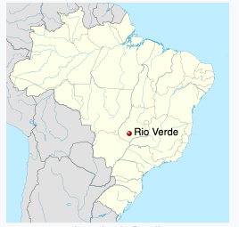
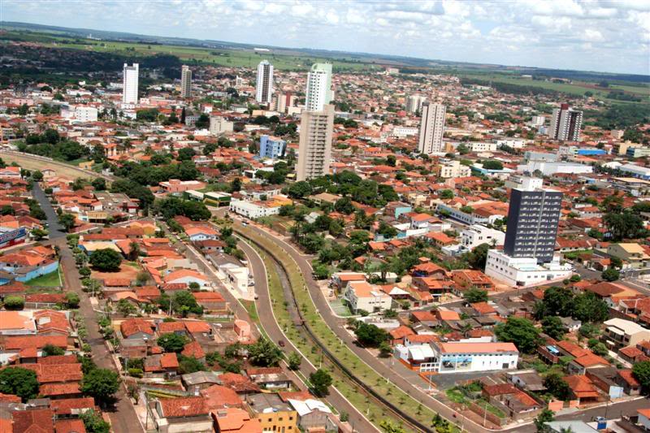
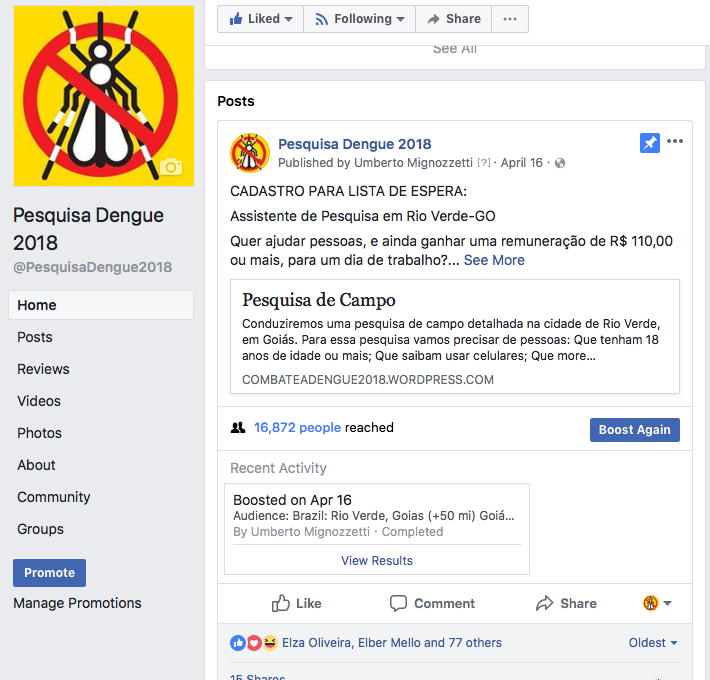
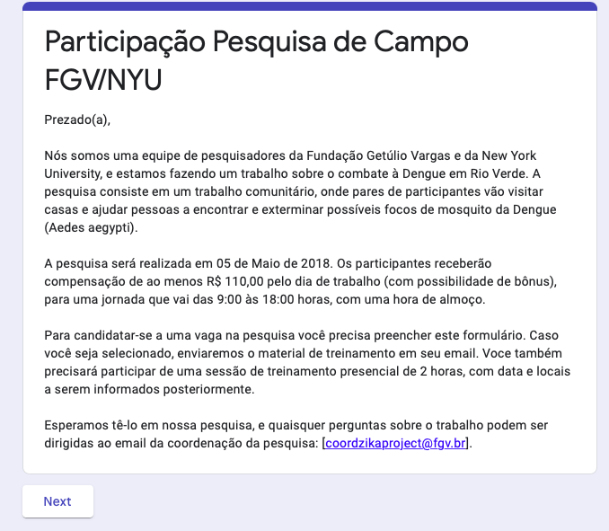

```{r setup, include=FALSE}
options(htmltools.dir.version = FALSE)
```

# Motivation

* Mosquitoes are the world's deadliest animal
--

* Nearly 700 million people contract mosquito-borne illnesses each year, causing more than one million deaths ([World Mosquito Programme 2020](https://www.worldmosquitoprogram.org/en/learn/mosquito-borne-diseases))
--

* Major vector: the *Aedes aegypti* mosquito
  - Spreads dengue fever, yellow fever, zika virus, chikungunya, and other diseases
--

* Forty percent of the world's population, about 3 billion people, live in areas with a risk of dengue ([CDC 2020](https://www.cdc.gov/globalhealth/stories/world-deadliest-animal.html))
--

* Last year, there were two major dengue outbreaks:
  - South-east Asia: 1 million cases ([WHO 2020](https://www.who.int/news-room/fact-sheets/detail/dengue-and-severe-dengue))
  - Latin America: 3 million cases reported ([PAHO 2020](https://www.paho.org/data/index.php/en/mnu-topics/indicadores-dengue-en/dengue-nacional-en/252-dengue-pais-ano-en.html))
---

# Motivation

* One vaccine for dengue has been tested in about 20 countries
  - Side effect: increases the risk of severe dengue in individuals who didn't have dengue prior to the vaccination
--

* Research shows that preventive health care policies are the most effective method to fight the *Aedes aegypti* mosquito ([Eisen et al. 2009](https://academic.oup.com/jme/article/46/6/1245/921096)).
--

* In particular, mosquito control requires teams of preventive healthcare workers to visit households to exterminate breeding sites
--

* However, while there is a substantial literature on how to create incentives for private workers (see [Lazear 2018](https://www.aeaweb.org/articles?id=10.1257/jep.32.3.195)), we know little about how to motivate civil servants ([Banerjee et al. 2008](https://academic.oup.com/jeea/article-abstract/6/2-3/487/2295851))
  - Constrains: job stability, limited oversight, corruption

---

# What we do

* We run a field experiment to measure the impact of different bonus schemes on the productivity of health care workers

* More specifically, we hired and trained subjects that had to visit houses and help residents to exterminate mosquito breeding sites in the city of Rio Verde, Brazil

* We chose Rio Verde as the *Aedes* mosquito is endemic to the city and in 2017 (one year prior to our experiment) Rio Verde had a high number of dengue infections

* We assigned performance monetary rewards in the form of individual and peer performance bonuses

* We measured if the experiment had an impact on the number of houses visited, time spent on each household, the number of breeding sites removed, the number of larvae exterminated, and dengue incidence

---

# What we find 

* We find that bonuses increased the number of cleaned breeding sites in both treatment status (individual and team bonuses), but team bonuses also improved larvae extermination 

* Control group presented a high incidence of houses visited in less than two minutes apart from each other, which suggests that the workers may cheat in the absence of financial incentives

* The intervention decreased the disease incidence in 10.3%, but the results are not robust across all time periods

* Overall, we show that performance bonuses also work in public health care

* Small financial incentives to health care workers can significantly reduce public health care costs on clinics and hospitals

---

# Rio Verde



---

# Rio Verde



---

# Rio Verde

 

---

# Rio Verde

* Rio Verde is a municipality in the Brazilian state of Goiás, about 420km from Brasília

* It is the fourth larger city in Goiás and the largest producer of grains in the state

* Out of the potential cities that could host the experiment (5), Rio Verde experienced the most substantial disease occurrence

* We worked in partnership with the Rio Verde City Hall and the Mayor's Office

---

# Recruitment

* Our goal was to select and train a group of participants to visit households in all neighbourhoods in Rio Verde

* We used Facebook advertisements to publicise our job offer

* The Facebook advertisement directed potential participants to a Google Form in which participants were told about the job and asked to leave an email address if interested 

* Using the e-mail address, we a Qualtrics survey with pre-treatment demographic questions

* To be eligible for the experiment, subjects should be over 18 years of age and had completed their participation in the field experiment

---

# Recruitment



---

# Recruitment



--- 

# Randomisation and masking

* We assigned participants to three types of monetary incentives:
  - Flat compensation regardless of performance (control group)
  - Individual performance bonus (individual treatment)
  - Peer performance bonus (collective treatment)

* Block randomisation applied on seven variables computed from pre-intervention surveys

*  To avoid spillover, we directed them to three separate headquarters (HQs), one for each treatment, geographically distanced from one another

* Participants knew about other groups, but unaware of the different payment schemes

---

# Training

* Participants received their monitoring cellphones and working kits on the 5th May, 2018

* Instructed on how to perform measurements and use the equipment

* Informed about the *Aedes aegypti* ecology

* Participants were paired randomly (a government requirement)

* Research assistants reinforced the treatment for each of the pairs in one-on-one discussions

---

# Treatment

* We informed all groups that we would monitor their performance in the field

* **Control group**: compensation without a performance assessment

* **Individual group**: double the compensation for anyone whose performance was above the median (baseline: 20 USD)

* **Collective treatment group**: double the compensation for each team whose performance was above the median (baseline: 40 dollars per pair) 

---

# Tasks

* Each pair had to visit about 120 households in 3 blocks

* Task: 
